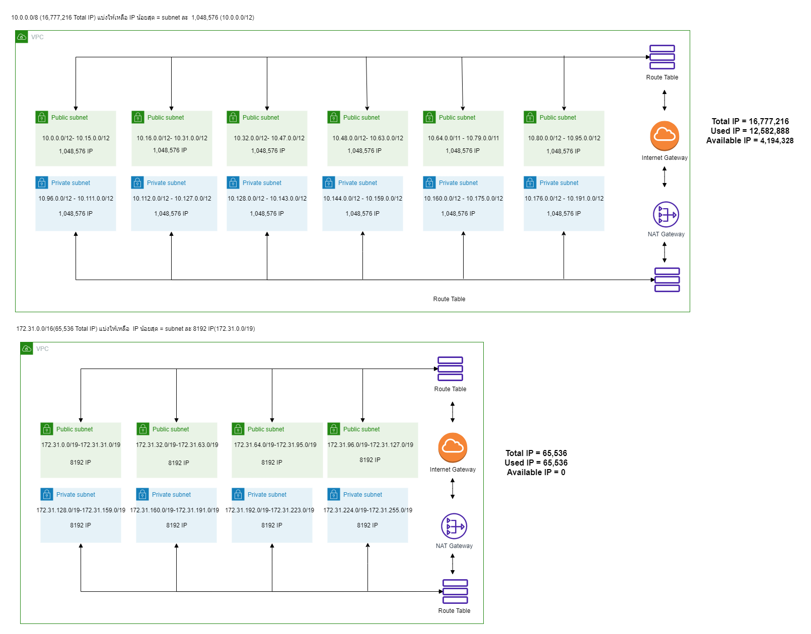
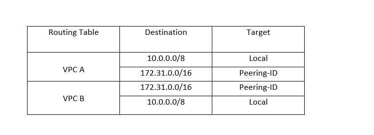
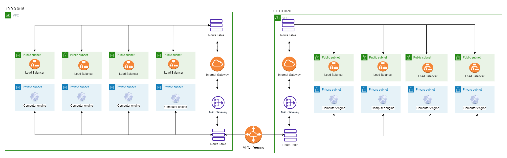
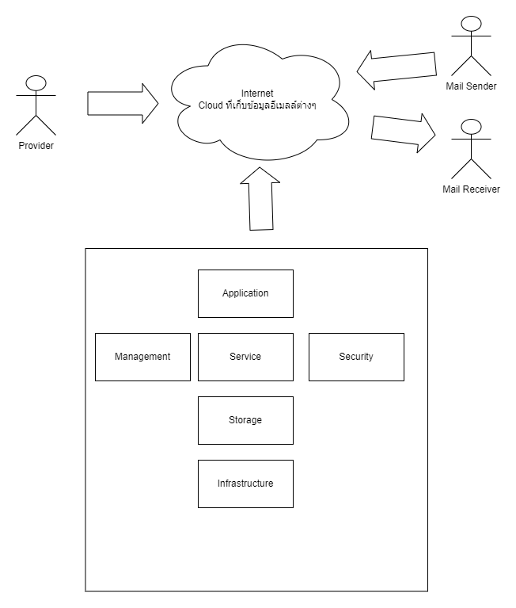

# **LAB Assignment 6**
### 1.กำหนดให้ VPC มี CIDR range 10.0.0.0/8(16,777,216 IP) จงออกแบบ subnet(vswitch) ตามรายละเอียดดังนี้
    1.1 public 6 zone พร้อมระบุจำนวน ip ที่ใช้ได้
    - ใช้ได้ Zone ละ 1,048,576 - 2 = 1,048,574 IP รวม 6 zone = 1,048,574*6 = 6,291,444 IP
    1.2 private: 6 zone พร้อมระบุจำนวน ip ที่ใช้ได้
    - ใช้ได้ Zone ละ 1,048,576 - 2 = 1,048,574 IP รวม 6 zone = 1,048,574*6 = 6,291,444 IP 
    1.3 ระบุจำนวน ip ที่ยังเหลือ
    - เหลือ 16,777,216 - 12,582,888 = 4,194,328 IP
    
* เงื่อนไข: ให้เหลือจำนวน Available IPs น้อยที่สุด

### 2.กำหนดให้ VPC มี CIDR range 172.31.0.0/16(65,536 IP) จงออกแบบ subnet(vswitch) ตามรายละเอียดดังนี้
    2.1 public 4 zone พร้อมระบุจำนวน ip ที่ใช้ได้
    - ใช้ได้ Zone ละ 8192 - 2 = 8190 IP รวม 4 zone = 8190 * 4 = 32,760 IP
    2.2 private: 4 zone พร้อมระบุจำนวน ip ที่ใช้ได้
    - ใช้ได้ Zone ละ 8192 - 2 = 8190 IP รวม 4 zone = 8190 * 4 = 32,760 IP
    2.3 ระบุจำนวน ip ที่ยังเหลือ
    - เหลือ 65,536 - 65,536 = 0 IP
* เงื่อนไข: ให้เหลือจำนวน Available IPs น้อยที่สุด

### 3.จากคำตอบข้อ 1 และ 2 ให้ตอบคำถามย่อยต่อไปนี้
    3.1 ต้องใช้ Service อะไรที่ทำให้ VPC จากข้อที่ 1 และ 2 สามารถรับส่งข้อมูลถึงกันได้
    - VPC Peering

    3.2 จงวาดตาราง Route Table พร้อมระบุการ ค่าให้เรียบร้อย

### 4.(optional) ให้ออกแบบระบบซื้อขายของออนไลน์โดยมีองค์ประกอบดังนี้

    4.1 สินค้า (product), ตะกร้าสินค้า(cart), จ่ายเงิน(payment), การขนส่งสิ่นค้า(Shipping), ผู้ใช้ (user)

    4.2 Database Service

    4.3 สามารถรองรับผู้ใช้งานได้จำนวนมหาศาล (แบบง่าย)

### 5.กำหนดให้ VPC A มี CIDR (10.0.0.0/16) และ VPC B  มี CIDR (10.0.0.0/20)จงตอบคำถามต่อไปนี้

    5.1 VPC A และ VPC B สามารถ peering กันได้หรือไม่ หากไม่ได้จงบอกเหตุผล
    - เชื่อมต่อกันได้

    5.2 กรณีถ้า Peering ได้ จะต้องทำอย่างไร ให้ service ที่อยู่ภายใน VPC ทั้งสองสามารถติดต่อสื่อสารกันได้
    - VPC Requester ส่งคำขอให้ VPC Accepter เพื่อเชื่อมต่อ VPC
    Peering กัน โดยเลขไซเดอร์ไม่ทับกัน และ VPC Accepter ตอบคกลงการเชื่อมต่อ โดยเชื่อมต่อเสร็จแล้วต้องเพิ่มเส้นทางการส่งข้อมูลเพื่อควบคุมการส่งข้อมูลด้วยตนเอง

    5.3 ให้วาดรูป architecture ประกอบ

    5.4 (Optional) ใส่ component อื่นๆ ให้ครบ เช่น LB, Compute Engine, NatGW

### 6.Hypervisor มีกี่ประเภทแต่ละประเภทคืออะไรบ้าง แล้วประเภทไหนที่ Computer ของเราใช้งานในการเปิด emulator 
    - มี 2 ประเภท คือ Type I กับ Type II ซึ่ง Type I จะทำงานบนฮาร์ดแวร์โดยตรง ไม่ต้องใช้ระบบปฎิบัติการอื่นเพื่อเรียกใช้ ส่วน Type II จะทำหน้าที่เป็นซอฟต์แวร์เพื่อเรียกใช้และจัดการเครื่องเสมือน ต้องทำงานผ่านระบบปฎิบัติการ
    โดยประเภทที่ Computer ใช้งานในการเปิด emulator คือ Type II

### 7.(optional) ให้ออกแบบ architecture ที่นำ application ของเรามาเชื่อมต่อกับ Cloud

### 8.ให้ตอบคำถามต่อไปนี้เกี่ยวกับ Debian 
    8.1 Debian คืออะไร
    - เป็นชุดของซอฟต์แวร์เสรีที่พัฒนาโดยอาสาสมัครภายใต้โครงการเดเบียน ที่ใช้ลินุกซ์เป็นเคอร์เนล และใช้เครื่องมือต่าง ๆ ในโครงการ GNU ประกอบกันเป็นระบบปฏิบัติการ

    8.2 version stable ล่าสุดมีชื่อเล่นว่าอะไร
    - Version 11 Bulleyes

    8.3 Package Manager ต้องใช้คำสั่งอะไร
    - dpkg --(คำสั่ง)

    8.4 หากต้องการติดตั้ง git ควรใช้คำสั่งอะไร
    - apt update     *เช็คการอัพเดทแพ็คเกจ 
      apt install git

### 9.ให้ตอบคำถามต่อไปนี้เกี่ยวกับ Alpine 

    9.1 Alpine คืออะไร 
    - ระบบปฏิบัติการที่พัฒนาโดยชุมชนซึ่งออกแบบมาสำหรับเราเตอร์ x86 ไฟร์วอลล์เครือข่ายส่วนตัวเสมือนโทรศัพท์ IP และเซิร์ฟเวอร์
    ออกแบบมาเพื่อใช้แนวคิดการรักษาความปลอดภัยซึ่งรวมถึงคุณลักษณะด้านความปลอดภัยที่ใช้งานอยู่เช่น PaX และ SSP ซึ่งสามารถป้องกันไม่ให้คู่แข่งใช้ช่องโหว่ของซอฟต์แวร์ได้

    9.2 version stable ล่าสุดมีคือ version อะไร
    - version 3.17.2

    9.3 Package Manager ต้องใช้คำสั่งอะไร
    - apk (คำสั่ง)

    9.4 หากต้องการติดตั้ง git ควรใช้คำสั่งอะไร
    - apk add git

### 10.ให้ตอบคำถามต่อไปนี้เกี่ยวกับ Amazonlinux 
    10.1 Amazonlinux คืออะไร
    -  Amazon Linux 2 เป็นระบบปฏิบัติการ Linux จาก Amazon Web Services (AWS) ซึ่งมีสภาพแวดล้อมการทำงานที่เน้นด้านการรักษาปลอดภัย เสถียร และมีประสิทธิภาพสูงเพื่อพัฒนาและรันแอปพลิเคชันบนระบบคลาวด์ Amazon Linux 2 ให้บริการโดยไม่คิดค่าบริการเพิ่มเติม AWS มีการอัปเดตระบบรักษาความปลอดภัยและการบำรุงรักษาสำหรับ Amazon Linux 2 อย่างต่อเนื่อง 

    10.2 version stable ล่าสุดมีชื่อเล่นว่าอะไร
    - version 2 Amazon Linux 2

    10.3 Package Manager ต้องใช้คำสั่งอะไร
    - yum (คำสั่ง)

    10.4 หากต้องการติดตั้ง git ควรใช้คำสั่งอะไร
    - yum install git

### 11.หากเราต้องการสร้างบริษัทเป็นผู้ให้บริการ Cloud จงตอบคำถามต่อไปนี้
    11.1 เราควรมีอุปกรณ์ Hardware อะไรบ้าง พร้อมอธิบาย
    - RAM CPU Graphic card เพื่อทำให้ตัวเซิฟเวอร์มีการทำงานที่รวดเร็ว 

    11.2 เราควรมี Software อะไรบ้าง พร้อมอธิบาย
    - Hypervisor Type II Container runtime engine

    11.3 วาดภาพ Architecture ของ Cloud Service ของเรา

    11.4 ชื่อ Cloud ที่เราให้บริการมีชื่อว่าอะไร
    -PAPO Mail

    11.5 Cloud ของเรามี service อะไร ที่ให้บริการผู้ใช้งานได้บ้าง
    - ให้บริการส่งเมลล์แบบง่ายๆ

